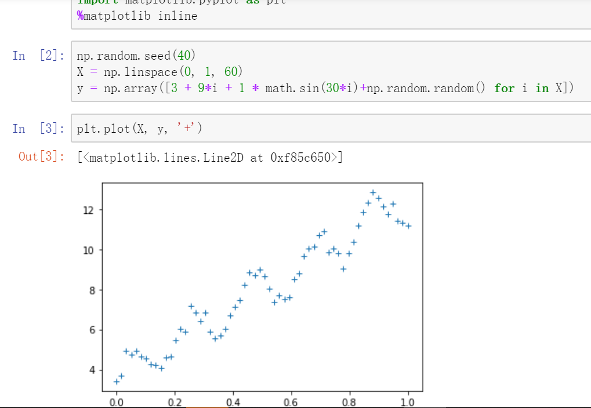
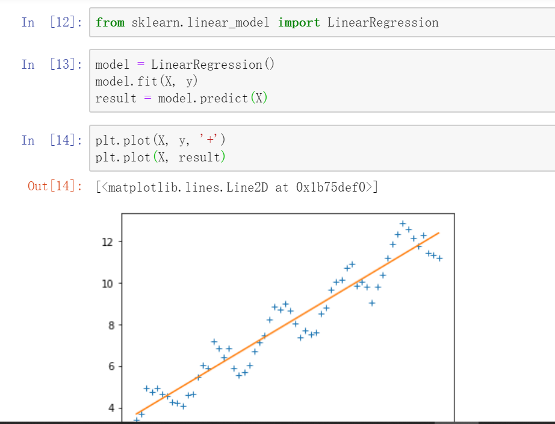

# 局部加权线性回归(LWLR)
普通的线性回归算法以线性的方式直接拟合数据，但这种简单的方式对于一些具有波动性和周期性的数据的效果却很差。

例如下面给出的数据：

如果对这样子的数据进行普通的线性回归拟合的话结果很不理想。拟合效果下图给出：

很明显图中的效果是欠拟合的。
**基本思路：**
局部加权回归对于这种线性关系不是很明显的数据在进一次预测就会重新修改模型的参数。而每一次重新改变模型的时候都会以输入的预测实例点所在位置附近的训练实例点为主构建模型。于是每一次修改都得对训练数据赋于不同的权重，离预测点越近权重越大，对模型的影响程度也就越大，否则权重就越小。因此，也还是在基本的线性模型上做一些修改。

对于原来的线性模型，代价函数为：
$$J(\theta) = \sum_{i = 1}^n (y_i - x^{(i)}\theta)^2$$
对于局部加权线性回归模型，代价函数就是在原来的基础上加上权值：
$$J(\theta) = \sum_{i = 1}^n w^{(i)}(y_i - x^{(i)}\theta)^2$$

那么对于$w^{(i)}$上面讲到会受到输入预测实例点和训练实例点的距离的影响
$$w^{(i)} = exp(-\frac{(x^{(i)} - x)^2}{2\tau^2})$$
从这个函数中可以看出，当样本点$x^{(i)}$离预测点近时，w值接近1，权值大；当样本点$x^{(i)}$离预测点近时，w值接近0，权值小。

函数为指数衰减函数，还有这里了分母的$\tau$为波长参数，用来控制权值w的下降速度。当$\tau$越大，权值下降得越慢；当$\tau$越小，权值下降的就越快，从这个函数中也可以看出，它参数分母位置，与结果趋势呈反比。

那么对于这个代价函数，办法依旧是使得代价函数最小化，对$\theta$求偏导，令导数等于零求得对应的参数$\theta$。

对于简单线性回归模型，将其使用矩阵方程表示：
$$J(\theta) = \frac{1}{2}(X\theta - y)^T(X\theta - y)$$

那么这里也是同样只是假如一个权值的矩阵：
$$J(\theta) = \frac{1}{2}(X\theta - y)^TW(X\theta - y)$$

同样对$\theta$求偏导也就要利用到这三个矩阵求导格式：
$$\frac{dAB}{dB} = A^T$$
$$\frac{dX^TAX}{dX} = 2AX$$
$$\frac{dX^TB}{dX} = B$$

这里注意的是W为对角矩阵，所以W的转置还是W下面就不表示为W。

最后求导后表示为：
$$\frac{\partial J(\theta)}{\partial \theta} = X^TWX\theta - X^TWy$$

令左式为零，就可以求得参数$\theta$:
$$\theta = (X^TWX)^{-1}X^TWy$$

**缺点：**上面也有讲到，这种方法每次预测时都得重新修改参数，也就是得重新再遍历一遍数据集进行建模，那么在预测大量数据的时候效率就会很低。

**非参数学习法**

不对目标函数的形式作出强烈假设的算法称为非参数机器学习算法，通过不做假设，它们可以从训练数据中自由地学习任何函数形式，即参数数量会随着训练样本数量的增长的算法。

像这次讨论的局部加权线性回归，参数值会随着预测点的不同而不同。类似的还有knn，支持向量机（SVM）

这种的优点在于灵活能够拟合大量的函数形式，同时缺点也是很明显，就是慢，对于每一个预测实例都要重新遍历数据集来预测。

**参数学习法**

假设可以最大程度地简化学习过程，与此同时也限制可以学习到是什么，这种算法简化成一个已知的函数形式，即通过固定数目的参数来拟合数据的算法。

像简单线性回归，这种模型的参数一经过训练就已经确定的，有点是容易理解，结果有解释性。同时缺点也很明显，这些确定的参数本身就已经限制了这个模型了。在朴素贝叶斯里面也是对条件概率分布做了条件独立性的假设，而且这是个较强的假设，朴素贝叶斯也因此得名。这种限制有时也会牺牲一定的准确率。